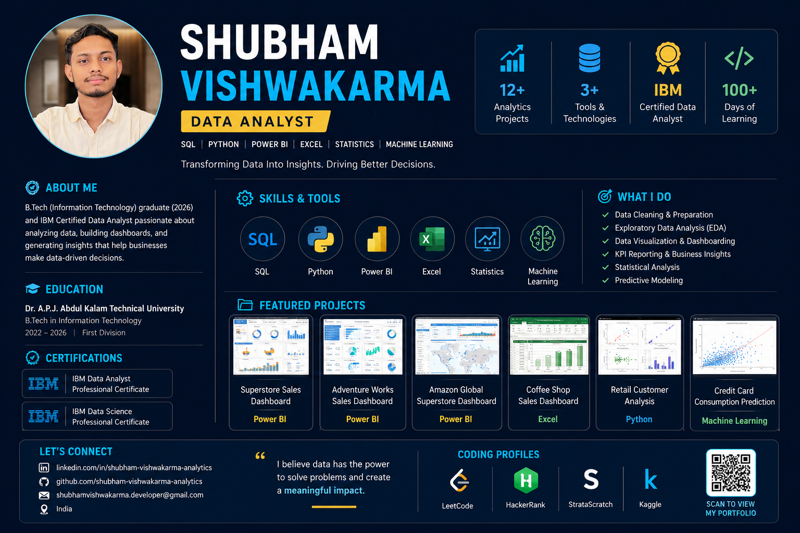

  

# 👋 Shubham Vishwakarma

# 👋 Shubham Vishwakarma

### Data Analyst | SQL | Python | Power BI | Excel | Statistics | Machine Learning | IBM Certified

📍 India

📧 Available for Data Analyst Opportunities

---

# About Me

I am a B.Tech Graduate in Information Technology (2026) and an IBM Certified Data Analyst with hands-on experience in Data Analytics, Business Intelligence, Data Visualization, Statistics, and Machine Learning.

I specialize in transforming raw data into actionable business insights through data analysis, dashboard development, statistical modeling, and predictive analytics.

Through multiple end-to-end analytics projects, I have gained practical experience in:

* Data Cleaning
* Exploratory Data Analysis (EDA)
* SQL Query Optimization
* Dashboard Development
* KPI Reporting
* Customer Analytics
* Sales Performance Analysis
* Predictive Modeling

I am passionate about solving business problems using data and continuously improving my analytical and technical skills through real-world projects and challenges.

---

# 🎯 Portfolio Highlights

✔️ 13+ Analytics & Machine Learning Projects

✔️ IBM Data Analyst Professional Certificate

✔️ IBM Data Science Professional Certificate

✔️ Microsoft SQL Server Professional Certificate

✔️ NASSCOM Data Visualization & Analytics Certified

✔️ 100 Days Machine Learning Challenge

✔️ Daily SQL Challenges Repository

✔️ End-to-End Dashboard Development

✔️ Predictive Analytics & Machine Learning Projects

---

# 🧰 Technical Skills

## 📊 Data Analytics

* Data Cleaning
* Exploratory Data Analysis (EDA)
* Data Visualization
* Statistical Analysis
* Business Intelligence
* KPI Reporting
* Business Insights

## 💻 SQL

* Joins
* Subqueries
* CTEs
* Window Functions
* Stored Procedures
* Query Optimization

## 🐍 Python

* Pandas
* NumPy
* Matplotlib
* Seaborn
* Scikit-Learn

## 📈 Power BI

* DAX
* Power Query
* Data Modeling
* Dashboard Development
* KPI Reporting

## 📊 Excel

* Pivot Tables
* Power Query
* Dashboards
* Advanced Formulas

## 🤖 Machine Learning

* Regression
* Classification
* Feature Engineering
* Model Evaluation
* Predictive Analytics

---

# 📂 Featured Projects

## 🔹 SQL Projects

* Superstore Sales Analysis (SQL)
  https://github.com/shubham-vishwakarma-analytics/Superstore-Sales-Analysis---SQL

* MovieLens SQL Case Study
  https://github.com/shubham-vishwakarma-analytics/MovieLens-SQL-CaseStudy

* Customer Orders Analysis (SQL)
  https://github.com/shubham-vishwakarma-analytics/Customer-Orders-Analysis---SQL

---

## 🔹 Power BI Projects

* Superstore Sales Analysis Dashboard
  https://github.com/shubham-vishwakarma-analytics/Superstore-Sales-Analysis-Dashboard---PowerBI

* Adventure Works Sales Analysis Dashboard
  https://github.com/shubham-vishwakarma-analytics/Adventure-Works-Sales-Analysis-Dashboards---PowerBI

* Amazon Global Superstore Sales Dashboard
  https://github.com/shubham-vishwakarma-analytics/Amazon-Global-Superstore-Sales-Dashboard---PowerBI

---

## 🔹 Excel Projects

* Coffee Shop Sales Analysis Dashboard
  https://github.com/shubham-vishwakarma-analytics/Coffee-Shop-Sales--Excel

* Superstore Sales Analysis Dashboard (Excel)
  https://github.com/shubham-vishwakarma-analytics/Superstore-Sales-Analysis-Dashboard---Excel

* Purchase & Shipping Products Analysis Dashboard
  https://github.com/shubham-vishwakarma-analytics/Purchase-Shipping-Products-Analysis-Dashboard---Excel

---

## 🔹 Python Projects

* Retail Customer Analysis Case Study
  https://github.com/shubham-vishwakarma-analytics/Retail-Customer-Analysis-Python-Case-Study-----Python

* Credit Card Data Analysis Case Study
  https://github.com/shubham-vishwakarma-analytics/Credit-Card-Data-Analysis-Python-Case-Study-----Python

---

## 🔹 Machine Learning Projects

* Credit Card Consumption Prediction
  https://github.com/shubham-vishwakarma-analytics/Credit-Card-Consumption-Prediction

---

# 🚀 Learning & Challenge Repositories

## SQL Practice Journey

* Daily SQL Challenges
  https://github.com/shubham-vishwakarma-analytics/Daily-SQL-Challenges

## Machine Learning Journey

* ML 100 Days Challenge
  https://github.com/shubham-vishwakarma-analytics/ML-100-Days-Challenge

## Excel Practice Journey

* Microsoft Excel 100 Days Challenge
  https://github.com/shubham-vishwakarma-analytics/Microsoft-Excel-100-Days-Challenge

---

# 🏅 Certifications

* IBM Data Science Professional Certificate
  https://www.coursera.org/account/accomplishments/professional-cert/J8BXGA7T30DQ

* IBM Data Analyst Professional Certificate
  https://www.coursera.org/account/accomplishments/professional-cert/OBFJD9DQLZRF

* Microsoft SQL Server Professional Certificate
  https://www.coursera.org/account/accomplishments/professional-cert/EQRT2MQFORL1

* NASSCOM Data Visualization & Analytics
  https://fsp-assessment-certificates.s3.ap-southeast-1.amazonaws.com/%27/s3/buckets/fsp-assessment-certificates%27/Shubham%2BVishwakarma_153347609.pdf.pdf

---

# 💻 Coding Profiles

* LeetCode
  https://leetcode.com/u/shubham-vishwakarma-analytics

* HackerRank
  https://www.hackerrank.com/profile/shubhamdata

* StrataScratch
  https://platform.stratascratch.com/user/shubhamvishwakarmaanalytics

* Kaggle
  https://www.kaggle.com/datadrivenshubham

---

# 💼 Experience

## Data Science & Analytics Trainee | AnalytixLabs

**July 2025 – Present**

* Completed 12+ Analytics and Machine Learning Projects
* Built Interactive Power BI and Excel Dashboards
* Performed SQL and Python-Based Data Analysis
* Applied Machine Learning Techniques on Real-World Business Problems
* Delivered Data-Driven Insights and Reports

---

# 📫 Contact

### LinkedIn

https://www.linkedin.com/in/shubham-vishwakarma-analytics

### GitHub

https://github.com/shubham-vishwakarma-analytics

---

## Open To Opportunities

* Data Analyst
* Junior Data Analyst
* Business Intelligence Analyst
* Reporting Analyst
* MIS Analyst
* Business Analyst
