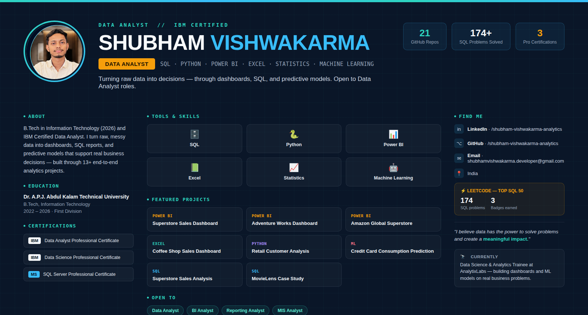

  

<h1 align="center">Shubham Vishwakarma</h1>

<b>Data Analyst</b> · SQL · Python · Power BI · Excel · Statistics · Machine Learning · IBM Certified

  <a href="https://www.linkedin.com/in/shubham-vishwakarma-analytics">LinkedIn</a> ·
  <a href="https://github.com/shubham-vishwakarma-analytics">GitHub</a> ·
  📍 India

  
  
  

---

## About Me

I am a B.Tech Graduate in Information Technology (2026) and an IBM Certified Data Analyst with hands-on experience in Data Analytics, Business Intelligence, Data Visualization, Statistics, and Machine Learning.

I specialize in transforming raw data into actionable business insights through data analysis, dashboard development, statistical modeling, and predictive analytics.

**What I work on day to day:**
- Data cleaning & preparation
- Exploratory data analysis (EDA)
- SQL query writing & optimization
- Dashboard development (Power BI, Excel)
- KPI reporting & business insights
- Customer & sales performance analysis
- Predictive modeling

---

## Portfolio at a Glance

| | |
|---|---|
| 🗂️ **Projects** | 13+ analytics & ML projects across SQL, Power BI, Excel, Python, and ML |
| 🎓 **Certifications** | IBM Data Analyst · IBM Data Science · Microsoft SQL Server · NASSCOM Data Viz |
| 💻 **GitHub** | 21 public repositories |
| 🧮 **LeetCode** | 174 SQL problems solved (88 MS SQL Server, 86 MySQL) · **Top SQL 50** badge · 100-day streak badge |
| 📈 **Learning logs** | 100-Days Machine Learning Challenge · Daily SQL Challenges · 100-Days Excel Challenge |
| 💼 **Current role** | Data Science & Analytics Trainee at AnalytixLabs (Jul 2025 – Present) |

---

## Technical Skills

<table>
<tr>
<td valign="top" width="33%">

**📊 Data Analytics**
- Data Cleaning
- Exploratory Data Analysis (EDA)
- Data Visualization
- Statistical Analysis
- Business Intelligence
- KPI Reporting

**💻 SQL**
- Joins & Subqueries
- CTEs
- Window Functions
- Stored Procedures
- Query Optimization

</td>
<td valign="top" width="33%">

**🐍 Python**
- Pandas
- NumPy
- Matplotlib
- Seaborn
- Scikit-Learn

**📈 Power BI**
- DAX
- Power Query
- Data Modeling
- Dashboard Development

</td>
<td valign="top" width="33%">

**📗 Excel**
- Pivot Tables
- Power Query
- Dashboards
- Advanced Formulas

**🤖 Machine Learning**
- Regression
- Classification
- Feature Engineering
- Model Evaluation

</td>
</tr>
</table>

---

## Featured Projects

### SQL
| Project | Description | Link |
|---|---|---|
| Superstore Sales Analysis | SQL-based sales and performance analysis on the classic Superstore dataset | [GitHub →](https://github.com/shubham-vishwakarma-analytics/Superstore-Sales-Analysis---SQL) |
| MovieLens SQL Case Study | Case study exploring user ratings and movie data with SQL | [GitHub →](https://github.com/shubham-vishwakarma-analytics/MovieLens-SQL-CaseStudy) |
| Customer Orders Analysis | SQL analysis of customer ordering behavior | [GitHub →](https://github.com/shubham-vishwakarma-analytics/Customer-Orders-Analysis---SQL) |

### Power BI
| Project | Description | Link |
|---|---|---|
| Superstore Sales Dashboard | Interactive Power BI dashboard for sales performance | [GitHub →](https://github.com/shubham-vishwakarma-analytics/Superstore-Sales-Analysis-Dashboard---PowerBI) |
| Adventure Works Sales Dashboard | Full sales analysis dashboard on the Adventure Works dataset | [GitHub →](https://github.com/shubham-vishwakarma-analytics/Adventure-Works-Sales-Analysis-Dashboards---PowerBI) |
| Amazon Global Superstore Dashboard | Global retail sales dashboard with regional breakdowns | [GitHub →](https://github.com/shubham-vishwakarma-analytics/Amazon-Global-Superstore-Sales-Dashboard---PowerBI) |

### Excel
| Project | Description | Link |
|---|---|---|
| Coffee Shop Sales Dashboard | Excel dashboard analyzing coffee shop sales trends | [GitHub →](https://github.com/shubham-vishwakarma-analytics/Coffee-Shop-Sales--Excel) |
| Superstore Sales Dashboard (Excel) | Excel-based version of the Superstore sales analysis | [GitHub →](https://github.com/shubham-vishwakarma-analytics/Superstore-Sales-Analysis-Dashboard---Excel) |
| Purchase & Shipping Analysis | Dashboard tracking purchase and shipping performance | [GitHub →](https://github.com/shubham-vishwakarma-analytics/Purchase-Shipping-Products-Analysis-Dashboard---Excel) |

### Python
| Project | Description | Link |
|---|---|---|
| Retail Customer Analysis | Python case study on retail customer behavior | [GitHub →](https://github.com/shubham-vishwakarma-analytics/Retail-Customer-Analysis-Python-Case-Study-----Python) |
| Credit Card Data Analysis | Python case study analyzing credit card transaction data | [GitHub →](https://github.com/shubham-vishwakarma-analytics/Credit-Card-Data-Analysis-Python-Case-Study-----Python) |

### Machine Learning
| Project | Description | Link |
|---|---|---|
| Credit Card Consumption Prediction | ML model predicting future credit card consumption from customer demographics, transaction behavior, loans, and investment data | [GitHub →](https://github.com/shubham-vishwakarma-analytics/Credit-Card-Consumption-Prediction) |

---

## Learning & Challenge Repositories

Consistent, documented practice — not just finished projects:

- 🏆 **Daily SQL Challenges** — [github.com/.../Daily-SQL-Challenges](https://github.com/shubham-vishwakarma-analytics/Daily-SQL-Challenges)
- 🤖 **ML 100 Days Challenge** — [github.com/.../ML-100-Days-Challenge](https://github.com/shubham-vishwakarma-analytics/ML-100-Days-Challenge)
- 📗 **Microsoft Excel 100 Days Challenge** — [github.com/.../Microsoft-Excel-100-Days-Challenge](https://github.com/shubham-vishwakarma-analytics/Microsoft-Excel-100-Days-Challenge)

---

## Certifications

| Certificate | Issuer | Verify |
|---|---|---|
| Data Analyst Professional Certificate | IBM | [View credential →](https://www.coursera.org/account/accomplishments/professional-cert/OBFJD9DQLZRF) |
| Data Science Professional Certificate | IBM | [View credential →](https://www.coursera.org/account/accomplishments/professional-cert/J8BXGA7T30DQ) |
| SQL Server Professional Certificate | Microsoft | [View credential →](https://www.coursera.org/account/accomplishments/professional-cert/EQRT2MQFORL1) |
| Data Visualization & Analytics | NASSCOM | [View certificate →](https://fsp-assessment-certificates.s3.ap-southeast-1.amazonaws.com/%27/s3/buckets/fsp-assessment-certificates%27/Shubham%2BVishwakarma_153347609.pdf.pdf) |

> Credential links go to the issuing platform's verification page rather than a downloaded file, so anyone reviewing this portfolio can confirm authenticity directly at the source.

---

## Coding Profiles

| Platform | Highlights | Profile |
|---|---|---|
| **LeetCode** | 174 SQL problems solved · Top SQL 50 badge · 100-day & 50-day streak badges | [leetcode.com/u/shubham-vishwakarma-analytics](https://leetcode.com/u/shubham-vishwakarma-analytics) |
| **HackerRank** | Badges in Python and SQL | [hackerrank.com/profile/shubhamdata](https://www.hackerrank.com/profile/shubhamdata) |
| **StrataScratch** | SQL & Python interview-style problem practice | [platform.stratascratch.com/.../shubhamvishwakarmaanalytics](https://platform.stratascratch.com/user/shubhamvishwakarmaanalytics) |
| **Kaggle** | Datasets, notebooks, and EDA practice | [kaggle.com/datadrivenshubham](https://www.kaggle.com/datadrivenshubham) |

---

## Experience

**Data Science & Analytics Trainee** — AnalytixLabs
*July 2025 – Present*

- Completed 12+ analytics and machine learning projects
- Built interactive Power BI and Excel dashboards
- Performed SQL and Python-based data analysis
- Applied machine learning techniques to real-world business problems
- Delivered data-driven insights and reports to stakeholders

---

## Education

**Dr. A.P.J. Abdul Kalam Technical University**
B.Tech, Information Technology — 2022 to 2026 (First Division)

---

## Let's Connect

I'm actively looking for opportunities as a **Data Analyst, Junior Data Analyst, Business Intelligence Analyst, Reporting Analyst, MIS Analyst,** or **Business Analyst**.

- 💼 LinkedIn: [linkedin.com/in/shubham-vishwakarma-analytics](https://www.linkedin.com/in/shubham-vishwakarma-analytics)
- 💻 GitHub: [github.com/shubham-vishwakarma-analytics](https://github.com/shubham-vishwakarma-analytics)

> *"I believe data has the power to solve problems and create a meaningful impact."*
